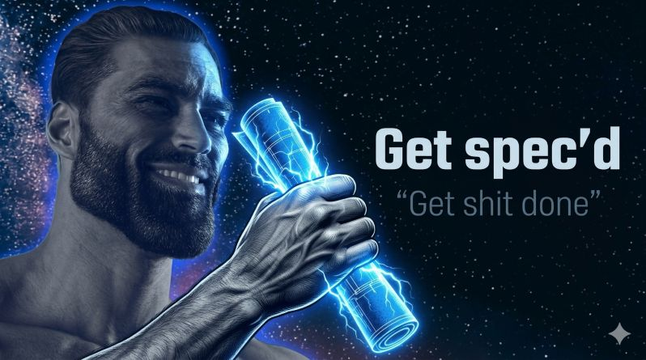

# Spec'd ⚡

⚠️ Work in progress

  

**Agentic spec-first development** — because great code starts with great specs (and you've got shit to do).

### Notes
- Use scripts to automatically scan for required files and ask the user instead of wasting tokens. Have a tool to tell the agent to directly call the script which gets the answers and returns them to the agent with telling the agent that it can ask additional questions if needed.
